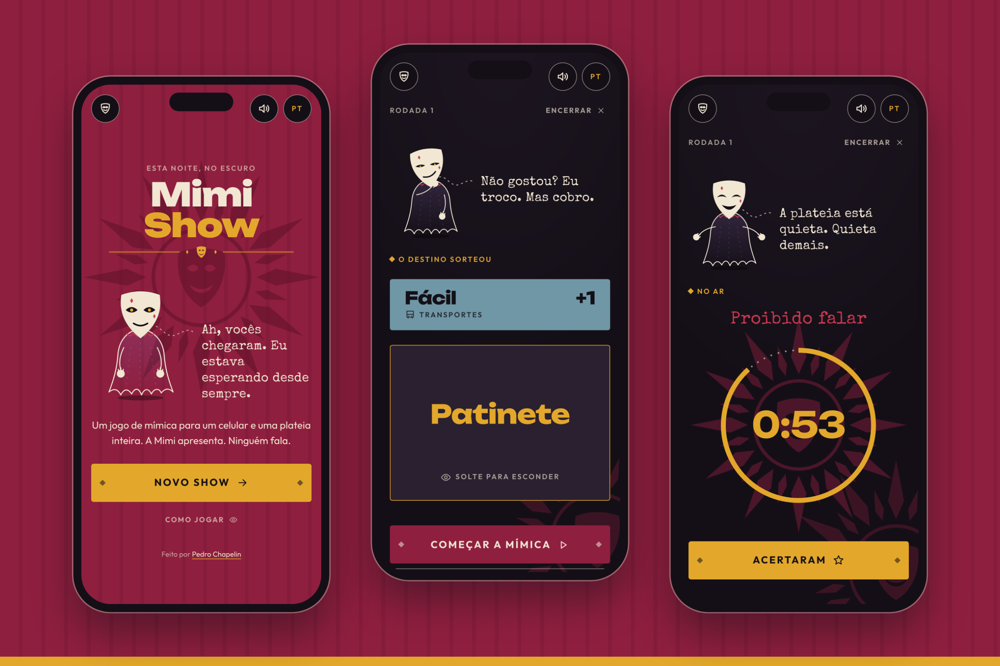

# 🎭 MimiShow

The charades game show for one phone and a whole crowd. Set up the cast, pass the phone around and let Mimi run the show. She is a shadow with a theatre mask for a face, mutters strange things, picks whose turn it is, draws the secret word, counts down the timer and keeps the scoreboard.

No sign-up and no server. Everything runs in the browser and the game is saved on the device, so a reload or a locked screen doesn't lose the show. The interface is in Portuguese, with an English toggle.



## Stack

Next.js 16 (static export), React 19, TypeScript, GSAP and CSS Modules.

## Development

```bash
npm install
npm run dev        # http://localhost:3000
npm test           # unit tests (game rules, reducers, word deck)
npm run build      # static export in out/
```

## Rules

- **Modes**: every star for themselves (2 to 15 players) or teams (2 to 4 teams, at least 2 players each). Teams are picked by hand, one card per team, or shuffled at random.
- **Order**: players are added from oldest to youngest, and that is the acting order. Teams take turns and rotate who acts.
- **House rules**: sliders for the points to win (10 to 60), the time to act (30 to 180 s) and the free swaps (0 to 5), plus the word categories in play.
- **Words**: 360 things (single nouns, no actions), localized for Brazil, in 10 categories: animals, food and drinks, objects, places, jobs, characters and celebrities, sports and games, music and parties, nature, transportation. Every category has easy, medium and hard words.
- **Difficulty**: drawn at random every turn. Easy is worth 1 point, medium 2, hard 3. The word only shows while the performer holds the card.
- **Swaps**: after the free swaps, each one costs 1 point, and with no points there are no swaps.
- **Scoring**: solo, the guesser and the performer both score. Teams, the team scores. If time runs out with no guess, nobody scores.
- **Winning**: the first to reach the target wins on the spot.

Made by [Pedro Chapelin](https://chapelin.com.br).
